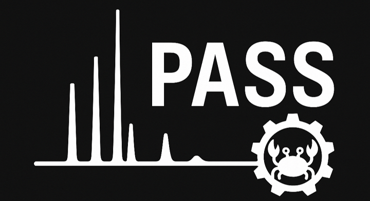

# PASS-CLI

<p align="center">
  <a href="https://github.com/<your‑username>/<your‑repo>">
    
  </a>
</p>

<!-- [](https://github.com/YourUser/PASS-CLI/actions) [](LICENSE) [](https://github.com/YourUser/PASS-CLI/actions) -->

PASS-CLI (**P**airwise **A**nalyzer for **S**pectral **S**imilarity) is a fast, cross‑platform Rust command‑line tool for untargeted mass spectrometry data spectral similarity analysis. It computes pairwise similarity scores between all MS/MS spectra in a run and exports the resulting similarity matrix in CSV, TSV, or JSON formats.

---

## Table of Contents

1. [Features](#features)
2. [Prerequisites](#prerequisites)
3. [Installation](#installation)
4. [Releases & Precompiled Binaries](releases-&-precompiled-binaries)
5. [Usage](#usage)
6. [Quick Start Example](#quick-start-example)
7. [Example Data & Expected Output](#example-data--expected-output)
8. [Output](#output)
9. [Similarity Methods](#similarity-methods)
10. [Performance](#performance)
11. [Roadmap](#roadmap)
12. [Tests](#tests)
13. [Contact & Support](#contact--support)
14. [Contributing](#contributing)
15. [License](#license)

---

## Features

* **Multi-format support**: Read `mzML` and `mzXML` files out of the box.
* **Similarity metrics**:

  * Standard cosine similarity
  * (Future) Modified cosine similarity (accounts for neutral losses and precursor mass shifts)
* **Parallel processing**: Built on [Rayon](https://crates.io/crates/rayon) for efficient multi‑threaded computation.
* **Flexible filtering**: Discard low‑intensity peaks and limit the number of spectra for rapid prototyping.
* **Output formats**: Export a full similarity matrix as `CSV`, `TSV`, or `JSON`.

## Prerequisites for Developers

* Rust (1.60 or later) and `cargo`
* Operating systems: Windows, macOS, Linux

## Installation

Clone the repository and compile:

```bash
# Clone the project
git clone https://github.com/nathanbrittin/PASS-CLI.git
cd PASS-CLI

# Build in release mode
cargo build --release
```

The resulting executable is:

* `target/release/pass-cli` (Unix)
* `target\release\pass-cli.exe` (Windows)

## Releases & Precompiled Binaries

Precompiled executables are available on the [GitHub Releases page](https://github.com/nathanbrittin/PASS-CLI/releases) for major platforms:

- **Linux/macOS**: `pass-cli`
- **Windows**: `pass-cli.exe`

### Installation from a Release

1. Download the appropriate `.tar.gz` (Linux/macOS) or `.zip` (Windows) file from the [latest release](https://github.com/nathanbrittin/PASS-CLI/releases).
2. Extract the archive and run the executable:

**Linux/macOS**
```sh
tar -xzf pass-cli-vX.Y.Z-linux.tar.gz
./pass-cli

**Windows**
1. Double-click "pass-cli.exe"
or
2. Open Command Prompt or PowerShell, navigate to the directory, and run the executable. Example:
```sh
.\pass-cli.exe

## Usage

PASS-CLI features an interactive, prompt-driven workflow to simplify operation for users who may be unfamiliar with complex command-line flags or syntax. On launch, the tool will guide you through each configuration step—there’s no need to remember options or refer back to documentation mid-run.

To get started, just execute the program:

```bash
# Unix
./target/release/pass-cli

# Windows
.\\target\\release\\pass-cli.exe
#or move the file to your directory
pass-cli.exe
```

You will be prompted to enter:

1. **Input file path** (mzML or mzXML)
2. **Output file path** (CSV, TSV, or JSON)
3. **Similarity metric** (`cosine` or `modified-cosine`)
4. **Minimum peak intensity** (e.g. `1000.0`)
5. **Mass tolerance** in Da (for modified cosine, e.g. `0.02`)
6. **Maximum number of spectra** (or leave blank to process all)

After entry, PASS‑CLI computes and saves the matrix.

## Quick Start Example

Assuming you have a small test file at `examples/test_run.mzML`:

```bash
# Run the tool
./target/release/pass-cli
# or
pass-cli.exe

# Enter when prompted:
# Input file path: examples/test_run.mzML
# Output file path: examples/test_similarity.csv
# Similarity metric: cosine
# Minimum peak intensity: 1000.0
# Mass tolerance: 0.02
# Maximum number of spectra: [ENTER]
```

Inspect `examples/test_similarity.csv`—it should look like:

```csv
  1,      2,        3
1,1.000000,0.812345,0.234567
2,0.812345,1.000000,0.456789
3,0.234567,0.456789,1.000000
```

## Example Data & Expected Output

A few example mzML are provided under `tests/data`. These files have all been verified to work.

## Output

The output file contains an N×N similarity matrix, where N is the number of spectra:

* The first row/column holds the scan identifiers or the scan index.
* Each cell `[i,j]` is the similarity score (0.0 – 1.0).

## Similarity Methods

### Cosine Similarity

* Standard vector cosine similarity with default peak m/z tolerance of `0.01` Da.
* Good for overall spectral shape comparisons.

### Modified Cosine Similarity

* Compensates for mass shifts and neutral losses between MS/MS spectra.
* Suitable for detecting related fragmentation patterns across different precursor masses.
* User‑configurable tolerance (`--mass-tolerance`).

## Performance

* Utilizes Rayon to parallelize O(N²) comparisons.
* Memory usage scales quadratically with the number of spectra.
* For large runs (> 10,000 spectra), consider downsampling or limiting via prompts.
* `Verbose` mode prints per‑step timings.

## Roadmap

* [ ] Implement the modified cosine score for effective comaprison of MS2 spectra
* [ ] Preprocessing filters (e.g., baseline subtraction, decharging)
* [ ] Chromatogram overlay with similarity mapping
* [ ] Export to network formats (e.g., GEXF, GraphML)
* [ ] Output visualization scripts for heatmaps and network graphs

## Tests

Run unit and integration tests:

```bash
cargo test -- --nocapture
```

Integration tests live in `tests/`, using sample data in `examples/`. CI runs these on each push.

## Contact & Support

* **GitHub Issues:** [https://github.com/YourUser/PASS-CLI/issues](https://github.com/YourUser/PASS-CLI/issues)
* **Email:** Nathan Brittin [nathan.brittin@wisc.edu](mailto:nathan.brittin@wisc.edu)

## Contributing

1. Fork the repo
2. Create a feature branch (`git checkout -b feature/YourFeature`)
3. Commit your changes (`git commit -m "Add feature X"`)
4. Push to your branch (`git push origin feature/YourFeature`)
5. Open a Pull Request

Please follow Rust formatting conventions (`cargo fmt`) and include tests where applicable.

## License

This project is licensed under the MIT License. See [LICENSE](LICENSE) for details.
